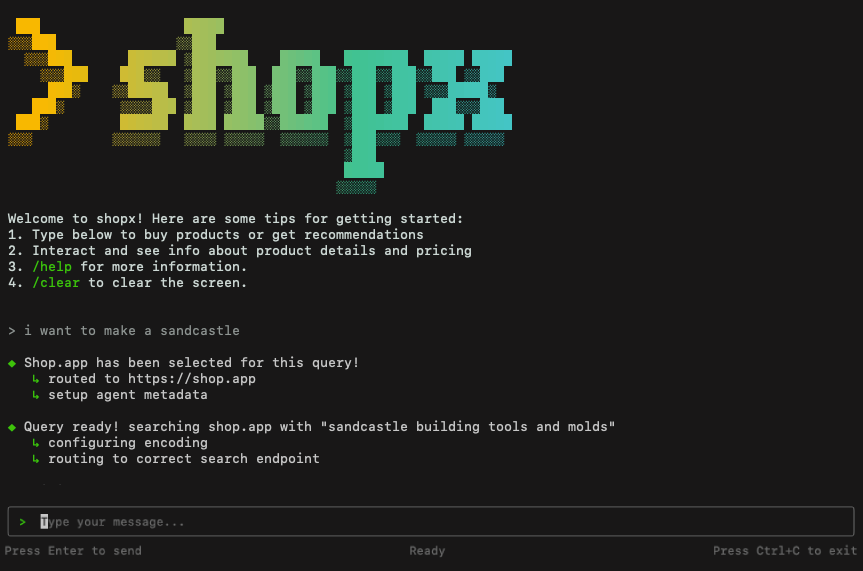

# shopx




claude code... but for shopping!

## Setup

**Note:** This is a hacky project we built at a hackathon, so expect some rough edges!

### Prerequisites

1. Get an OpenRouter API key from [OpenRouter](https://openrouter.ai/)
2. Create a `.env` file in the root directory with your API key:
   ```
   OPENROUTER_API_KEY=your_api_key_here
   ```

### Installation & Running

1. Install dependencies:

   ```bash
   npm i
   ```

2. Build the project:

   ```bash
   npm run build
   ```

3. Run the CLI:
   ```bash
   node ./dist/cli/source/cli.js
   ```

### Alternative: Global Installation

You can also install the CLI globally for easier access:

1. Install globally:

   ```bash
   npm install -g .
   ```

if you get permission errors, you can try the very sus option of using sudo:

```bash
sudo npm install -g .
```

enjoy shopping from your humble terminal (◡◕⏖◕)ᑐ🝐 ⠁⭒*.✩.*⭒⠁
